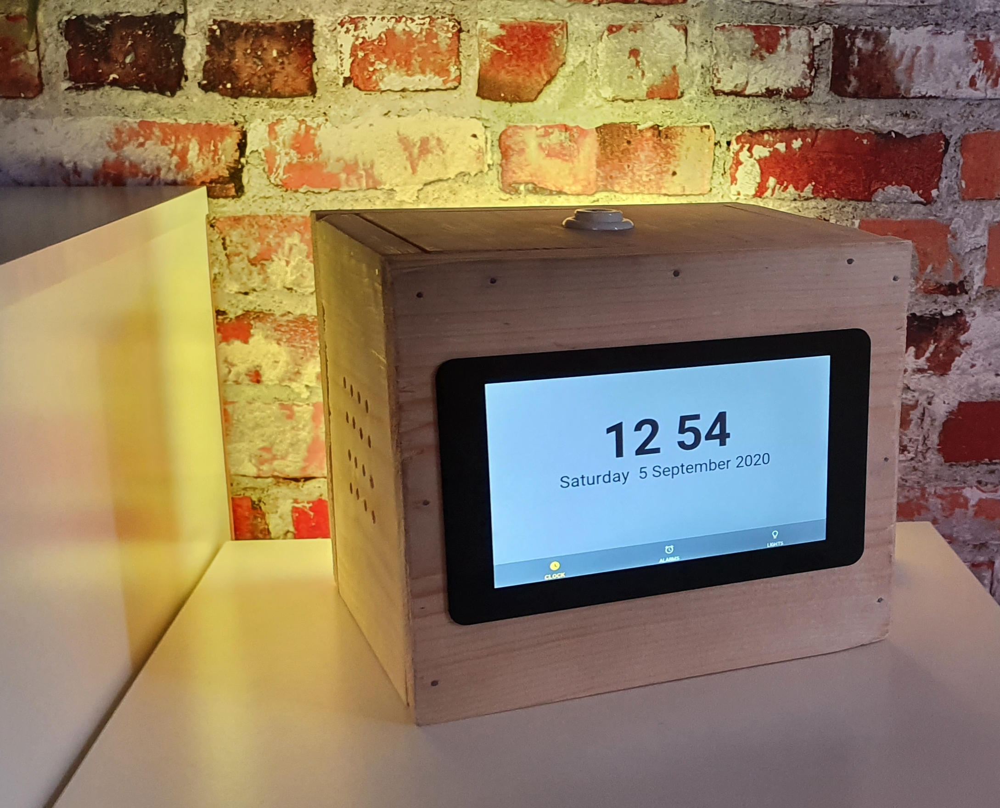
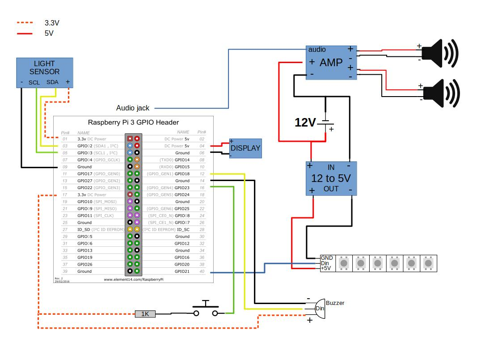

# Sunrise Alarm

DIY alarm clock



## Local development

Dependencies:

- Golang
- ALSA dev library
  - Fedora: `sudo dnf install alsa-lib-devel`

```bash
# Update vendor libraries
./update-vendors.sh

# Auto-restart Sunrise Alarm on changes to the code
go install github.com/cespare/reflex@latest
reflex -s -G alarms.json go run ./cmd/
```

**NOTE:** GUI optimized for [Raspberry Pi Touch Display](https://www.raspberrypi.com/products/raspberry-pi-touch-display/) (800x480px)

## Deployment

```bash
# Enable SSH access
sudo raspi-config

# Give GPU 256MB of memory
sudo raspi-config nonint do_memory_split 256

# Enable I2C (0 = enabled, 1 = disabled)
sudo raspi-config nonint do_i2c 0

# Set hostname
sudo hostnamectl set-hostname sunrise

# Disable swap
# Based on https://raspberrypi.stackexchange.com/questions/84390/how-to-permanently-disable-swap-on-raspbian-stretch-lite
sudo dphys-swapfile swapoff
sudo dphys-swapfile uninstall
sudo systemctl disable dphys-swapfile
sudo update-rc.d dphys-swapfile remove
sudo apt purge dphys-swapfile

# Write all logs to RAM (will be exported anyway)
# Based on https://raspberrypi.stackexchange.com/questions/124605/stop-logs-from-writing-to-var-log
sudo tee -a /etc/fstab <<EOF
tmpfs /tmp tmpfs defaults,noatime,mode=1777 0 0
tmpfs /var/tmp tmpfs defaults,noatime,mode=1777 0 0
tmpfs /var/log tmpfs defaults,noatime,mode=0755 0 0
tmpfs /var/spool tmpfs defaults,noatime,mode=1777 0 0
EOF

# Export logs
RSYSLOG_SERVER='' # IP or hostname
sudo tee /etc/rsyslog.d/rsyslog-99-graylog.conf <<EOF
*.* @${RSYSLOG_SERVER:?}:1514;RSYSLOG_SyslogProtocol23Format
EOF
sudo systemctl restart rsyslog

# Upgrade system
sudo apt update
sudo apt dist-upgrade -y
sudo reboot # Needed for "Log to RAM" anyway

# Install dependencies
sudo apt install -y firefox-esr onboard libasound2-dev

# Install Go
# Update below to latest version at https://go.dev/dl/
# See https://go.dev/doc/install for official instructions
GO_URL="https://go.dev/dl/go1.19.3.linux-arm64.tar.gz"
wget -O go.linux-arm64.tar.gz "${GO_URL:?}"
sudo rm -rf /usr/local/go ~/go || true # Removes old install
sudo tar -C /usr/local -xzf go.linux-arm64.tar.gz
rm go.linux-arm64.tar.gz
sudo tee /etc/profile.d/add-go-to-path.sh <<EOF
export PATH=\$PATH:/usr/local/go/bin
export GOPATH=~/go
EOF
source /etc/profile.d/add-go-to-path.sh

# Clone this repo
git config --global pull.ff only
git clone https://github.com/JenswBE/sunrise-alarm
cd sunrise-alarm

# Setup Sunrise Alarm
# It's intended below variables are not escaped!
sudo mkdir -p /etc/systemd/system
sudo tee /etc/systemd/system/sunrise-alarm.service <<EOF
[Unit]
Description=Sunrise Alarm

[Service]
WorkingDirectory=${HOME:?}/sunrise-alarm
Environment="GOPATH=${GOPATH:?}"
Environment="HOME=${HOME:?}"
Environment="PATH=${PATH:?}"
ExecStartPre=-$(which git) pull
ExecStartPre=-$(which bash) src/update_vendors.sh
ExecStartPre=$(which bash) -c "cd src; go build -o ../sunrise-alarm ./cmd/"
ExecStart=${HOME:?}/sunrise-alarm/sunrise-alarm

[Install]
WantedBy=default.target
EOF
sudo systemctl daemon-reload
sudo systemctl enable --now sunrise-alarm

# Configure screen timeout
mkdir -p ~/.config/autostart
tee ~/.config/autostart/screen-timeout.desktop <<EOF
[Desktop Entry]
Type=Application
Name=Set screen timeout
Exec=/usr/bin/xset dpms 60 60 60
EOF

# Reboot
sudo reboot

# Open GUI
xdg-open "http://localhost:8123"
```
