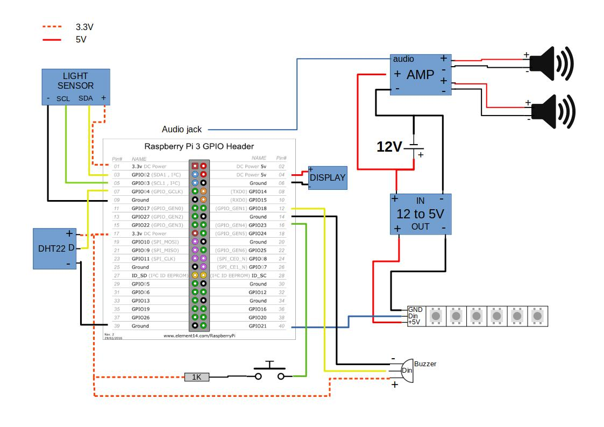

# Sunrise Alarm
DIY alarm clock using microservices



## Services
- srv-config: Configuration management (Rust)
- srv-alarm: Contains main logic of the alarm (Rust)
- srv-physical: Service which interacts with physical alarm features: buttons, LED's, ... (Python FastAPI)
- srv-audio: Everything related to sound (Rust)
- api-watchface: REST API to support watchface UI (Rust)
- gui-watchface: Web UI for touchscreen (Vue.js)

## Ports
| Service       | Development | Deployment (inside container) |
|---------------|:-----------:|:-----------------------------:|
| srv-alarm     |     8000    |               80              |
| srv-config    |     8001    |               80              |
| srv-physical  |     8002    |               80              |
| srv-audio     |     8003    |               80              |
| api-watchface |     8004    |               80              |
| gui-watchface |     8080    |               80              |
| MQTT broker   |     1883    |              1883             |

## Cross-compilation
https://users.rust-lang.org/t/static-cross-build-for-arm/9100/2

```bash
sudo apt-get install -qq gcc-arm-linux-gnueabihf
rustup target add armv7-unknown-linux-musleabihf
cd src/srv-config
export CARGO_TARGET_ARMV7_UNKNOWN_LINUX_MUSLEABIHF_LINKER=arm-linux-gnueabihf-gcc
export CC_armv7_unknown_linux_musleabihf=arm-linux-gnueabihf-gcc
cargo build --target armv7-unknown-linux-musleabihf
```